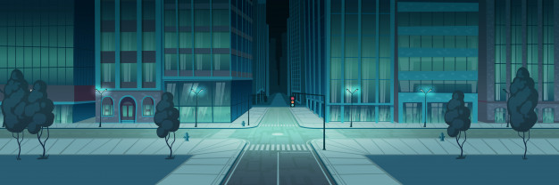

# Toxic Sludge

Built with the following technologies: Javascript, CSS, HTML

Toxic Sludge is a 2-dimensional puzzle game inspired by Microsoft's Pipe Dream

Play the game here: https://toxic-sludge.herokuapp.com

# Background and Overview

The player must connect an entry pipe to an exit pipe through manipulating intermediary pipes. Toxic Sludge differs from its inspiration in that all pipe-pieces are present on the screen at the start of the game, and must be rotated rather than freely placed.

# Functionality

- Route the toxic sludge underneath the town via the pipelines.
- Pipe pieces can be manipulated by rotating them.
- If a pipe isn't connected correctly the sludge may leak out and poison the town's drinking water!

<p align="center">
  
</p>
<p align="center">
  
</p>

# Class Methods and OOP

Shape Class

```js
Shape.prototype.validPipeFlow = function(nextPipe, prevDir) {
  let type = nextPipe.type;
  let index = nextPipe.orientationIndex;
  switch (type) {
    case "straight":
      let straight = new Straight(index, this.ctx);
      return straight.validFlow(prevDir);
    case "elbow":
      let elbow = new Elbow(index, this.ctx);
      return elbow.validFlow(prevDir);
    case "cross":
      return true;
  }
};
Shape.prototype.drawSludge = async function(nextPipe, prevDir, ctx) {
  let index = nextPipe.orientationIndex;
  let x = nextPipe.xRange[0];
  let y = nextPipe.yRange[0];
  let returnVal;
  switch (nextPipe.type) {
    case "straight":
      let straight = new Straight(index, ctx);
      returnVal = await straight.drawSludge(ctx, x, y, prevDir, 1, index);
      return returnVal;
    case "elbow":
      let elbow = new Elbow(index, ctx);
      returnVal = await elbow.drawSludge(
        ctx,
        x,
        y,
        prevDir,
        (0.5 * Math.PI) / 200,
        index
      );
      return returnVal;
    case "cross":
      let cross = new Cross(index, ctx);
      returnVal = await cross.drawSludge(ctx, x, y, prevDir, 1, index);
      return returnVal;
  }
```

Elbow Class

```js
  this.orientationArr = [
      {
        offset_x: 0,
        offset_y: 0,
        start: 0 * Math.PI,
        end: 0.5 * Math.PI,
        openPoints: ["left", "top"],
        corner: "topLeft"
      },
      {
        offset_x: 50,
        offset_y: 0,
        start: 0.5 * Math.PI,
        end: 1 * Math.PI,
        openPoints: ["top", "right"],
        corner: "topRight"
      },
      {
        offset_x: 0,
        offset_y: 50,
        start: 1.5 * Math.PI,
        end: 2 * Math.PI,
        openPoints: ["left", "bottom"],
        corner: "bottomLeft"
      },
      {
        offset_x: 50,
        offset_y: 50,
        start: 1 * Math.PI,
        end: 1.5 * Math.PI,
        openPoints: ["right", "bottom"],
        corner: "bottomRight"
      }
    ];
    this.outDir = "";
    this.outPoint = "";
  }

  draw(ctx, x, y) {
    let orientation = this.orientationArr[this.orientationIndex];
    ctx.clearRect(x + 1, y + 1, 49, 49);
    ctx.beginPath();
    ctx.arc(
      x + orientation.offset_x,
      y + orientation.offset_y,
      this.radius,
      orientation.start,
      orientation.end
    );
    ctx.lineWidth = 15;
    ctx.stroke();
  }
  async drawSludge(ctx, x, y, prevDir, sludgeStep, index) {
    let orientation = this.orientationArr[index];
    let newStart, newEnd;
    await this.sleepFunction(5);
    ctx.beginPath();
    const nextSpaceArr = new Array(5);
    // positive arc direction
    if (prevDir === "right" && orientation.corner === "bottomLeft") {
      newStart = 1.5 * Math.PI;
      newEnd = newStart + sludgeStep;
      nextSpaceArr[0] = 1;
      nextSpaceArr[1] = x + orientation.offset_x;
      nextSpaceArr[2] = x + orientation.offset_x + 50;
      nextSpaceArr[3] = y + orientation.offset_y;
      nextSpaceArr[4] = y + orientation.offset_y + 50;
    }
    if (prevDir === "down" && orientation.corner === "topLeft") {
      newStart = 0;
      newEnd = newStart + sludgeStep;
      nextSpaceArr[0] = 2;
      nextSpaceArr[1] = x + orientation.offset_x - 50;
      nextSpaceArr[2] = x + orientation.offset_x;
      nextSpaceArr[3] = y + orientation.offset_y;
      nextSpaceArr[4] = y + orientation.offset_y + 50;
    }
    if (prevDir === "up" && orientation.corner === "bottomRight") {
      newStart = 1 * Math.PI;
      newEnd = newStart + sludgeStep;
      nextSpaceArr[0] = 0;
      nextSpaceArr[1] = x + orientation.offset_x;
      nextSpaceArr[2] = x + orientation.offset_x + 50;
      nextSpaceArr[3] = y + orientation.offset_y - 50;
      nextSpaceArr[4] = y + orientation.offset_y;
    }
    if (prevDir === "left" && orientation.corner === "topRight") {
      newStart = 0.5 * Math.PI;
      newEnd = newStart + sludgeStep;
      nextSpaceArr[0] = 3;
      nextSpaceArr[1] = x + orientation.offset_x - 50;
      nextSpaceArr[2] = x + orientation.offset_x;
      nextSpaceArr[3] = y + orientation.offset_y - 50;
      nextSpaceArr[4] = y + orientation.offset_y;
    }
    // negative arc direction
    if (prevDir === "up" && orientation.corner === "bottomLeft") {
      newEnd = 0 * Math.PI;
      newStart = newEnd - sludgeStep;

      nextSpaceArr[0] = 2;
      nextSpaceArr[1] = x + orientation.offset_x - 50;
      nextSpaceArr[2] = x + orientation.offset_x;
      nextSpaceArr[3] = y + orientation.offset_y - 50;
      nextSpaceArr[4] = y + orientation.offset_y;
    }
    if (prevDir === "left" && orientation.corner === "bottomRight") {
      newEnd = 1.5 * Math.PI;
      newStart = newEnd - sludgeStep;
      nextSpaceArr[0] = 1;
      nextSpaceArr[1] = x + orientation.offset_x - 50;
      nextSpaceArr[2] = x + orientation.offset_x;
      nextSpaceArr[3] = y + orientation.offset_y;
      nextSpaceArr[4] = y + orientation.offset_y + 50;
    }
    if (prevDir === "right" && orientation.corner === "topLeft") {
      newEnd = 0.5 * Math.PI;
      newStart = newEnd - sludgeStep;
      nextSpaceArr[0] = 3;
      nextSpaceArr[1] = x + orientation.offset_x;
      nextSpaceArr[2] = x + orientation.offset_x + 50;
      nextSpaceArr[3] = y + orientation.offset_y - 50;
      nextSpaceArr[4] = y + orientation.offset_y;
    }
    if (prevDir === "down" && orientation.corner === "topRight") {
      newEnd = 1 * Math.PI;
      newStart = newEnd - sludgeStep;
      nextSpaceArr[0] = 0;
      nextSpaceArr[1] = x + orientation.offset_x;
      nextSpaceArr[2] = x + orientation.offset_x + 50;
      nextSpaceArr[3] = y + orientation.offset_y;
      nextSpaceArr[4] = y + orientation.offset_y + 50;
    }
    ctx.arc(
      x + orientation.offset_x,
      y + orientation.offset_y,
      this.radius,
      newStart,
      newEnd
    );

    ctx.lineWidth = 10;
    ctx.strokeStyle = "#32CD32";
    ctx.stroke();
    ctx.strokeStyle = "#000000";

    if (sludgeStep < 0.5 * Math.PI) {
      return this.asyncDrawSludge(
        x,
        y,
        prevDir,
        sludgeStep + (0.5 * Math.PI) / 200,
        index
      );
    } else {
      return nextSpaceArr;
    }
  }
  //sludgeStep should be (.5 * Math.PI)/200

  asyncDrawSludge(x, y, prevDir, sludgeStep, index) {
    this.drawSludge(this.ctx, x, y, prevDir, sludgeStep, index);
  }
```

# Board Class

```js

rotateShape(clickSpot) {
  let [x, y] = [clickSpot[0], clickSpot[1]];
  const ranges = Object.keys(this.shapesObj);
  let selectShape;
  ranges.forEach(range => {
    let rangeArr = range.split(",").map(s => parseInt(s));
    if (
      x >= rangeArr[0] &&
      x <= rangeArr[1] &&
      y >= rangeArr[2] &&
      y <= rangeArr[3]
    ) {
      selectShape = this.shapesObj[range];

      let selectId = selectShape.orientationIndex;
      if (selectShape.type === "elbow") {
        selectId = Math.floor((selectId + 1) % 4);
        selectShape.reDraw(selectId, range, this.ctx, selectShape.type);
        this.shapesObj[range].orientationIndex = selectId;
      }
      if (selectShape.type === "straight") {
        selectId = Math.floor((selectId + 1) % 2);
        selectShape.reDraw(selectId, range, this.ctx, selectShape.type);
        this.shapesObj[range].orientationIndex = selectId;
      }
    }
  });
}

findDirection(dirString) {
  const directionOptionsObj = {
    0: "right",
    1: "down",
    2: "left",
    3: "up"
  };
  let coordinateArr = dirString.split(",");
  let direction = directionOptionsObj[parseInt(coordinateArr.shift())];
  let coordinates = coordinateArr.map(s => parseInt(s));
  let newX1, newX2, newY1, newY2;
  let [x1, x2, y1, y2] = coordinates;
  let newCoordinateString;
  switch (direction) {
    case "right":
      newX1 = x1 + 50;
      newX2 = x2 + 50;
      newCoordinateString = [newX1, newX2, y1, y2].join(",");
      break;
    case "left":
      newX1 = x1 - 50;
      newX2 = x2 - 50;
      newCoordinateString = [newX1, newX2, y1, y2].join(",");
      break;
    case "up":
      newY1 = y1 + 50;
      newY2 = y2 + 50;
      newCoordinateString = [x1, x2, newY1, newY2].join(",");
      break;
    case "down":
      newY1 = y1 - 50;
      newY2 = y2 - 50;
      newCoordinateString = [x1, x2, newY1, newY2].join(",");
      break;
  }
  let nextShapeObj = this.shapesObj[newCoordinateString];
  return [direction, nextShapeObj];
}
```
