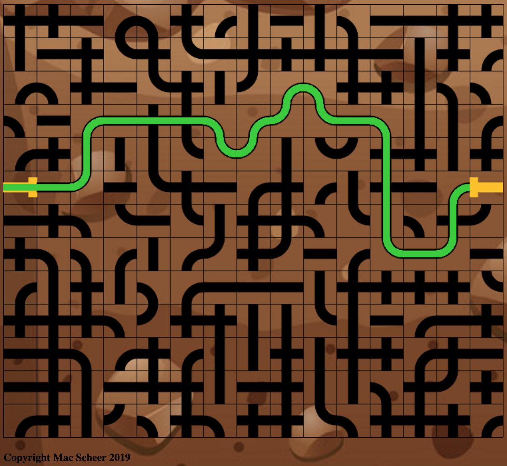

# Toxic Sludge

Toxic Sludge is a 2-dimensional puzzle game inspired by Microsoft's Pipe Dream
Play the game here: https://toxic-sludge.herokuapp.com

# Background and Overview

The player must connect an entry pipe to an exit pipe through manipulating intermediary pipes. Toxic Sludge differs from its inspiration in that all pipe-pieces are present on the screen at the start of the game, and must be rotated rather than freely placed.

Primarily built with the combination of following technologies:

Javascript, CSS, HTML, Firebase

# Functionality and MVP

- Toxic sludge moves through pipelines. Route the sludge through the town via the pipelines.
- Pipe pieces can be manipulated by rotating them
- If a pipe isn't connected correctly the sludge may leak out and poison the town's drinking water and cause health hazards.
- Levels of difficulty

  

